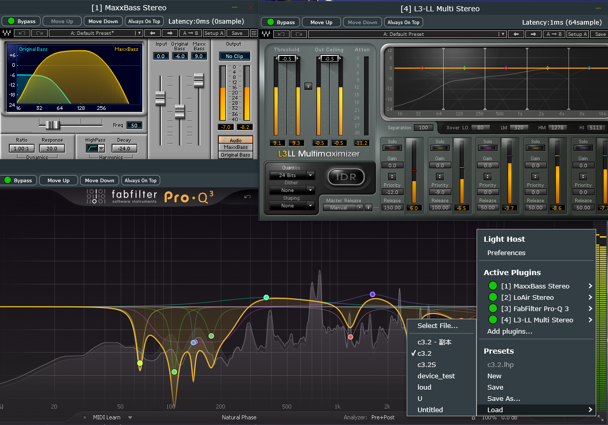

Light Host Reforge
---

English|[简体中文](readme_zh.md)

A fork of [LightHost](https://github.com/opencma/LightHost) with the following changes:

- Ported to JUCE8
- Added support for Waves plugins (tested with Waves V15)
- Added effect chain preset system
- Added plugin window toolbar
- Added Loopback audio device type, capable of capturing desktop audio into the effect chain (Windows only, no output support)
- Support for resizing plugin windows, partial HiDPI support
- Support for keeping plugin windows on top
- Added plugin bypass status display
- Added fade-in/fade-out transition when audio chain changes
- Added display of plugin latency and total chain latency
- Changed to CMake build system

Notes:

- Temporarily disabled support for VST2/AU format plugins
- Currently only built and tested on Windows; will build on Linux later. macOS support cannot be provided as I don't own Apple devices

## Build

Windows (using VS2022 + vcpkg):

```bash
vcpkg install juce asiosdk
mkdir build
cd build
cmake -DCMAKE_TOOLCHAIN_FILE=path\to\vcpkg.cmake ..
MSBuild .\LightHostReforge.sln /p:Configuration=Release
```

### Screenshot



---

# Light Host

---

A simple VST/AU host for OS X, Windows, and Linux that sits in the menu/task bar.

### Features

See [#1](https://github.com/rolandoislas/LightHost/issues/1)

### Screenshot


